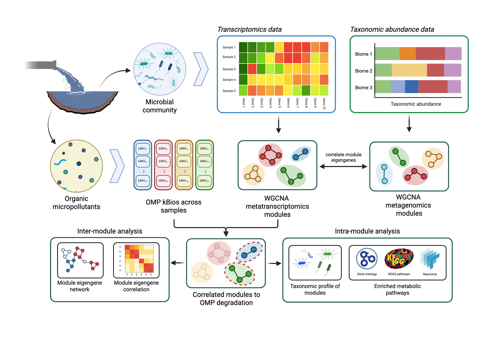

# metaWGCNA

## Overview
This repository contains the analysis pipeline, data, and source code for the **metaWGCNA** framework: a co-expression analysis of metatranscriptomics to understand organic micropollutants degradation in complex microbiomes. This study applies Weighted Gene Co-expression Network Analysis (WGCNA) to analyze metatranscriptomics and metagenomics from single-omics and multi-omics perspectives at the module level. The main purpose is to understand Organic Micropollutant (OMP) degradation rates in wastewater microbiomes.



## Objectives

1. **Metatranscriptomics WGCNA:** Identify co-expression modules from taxonomic groups and correlate them with OMP degradation rates.
2. **Metagenomics WGCNA:** Analyze taxonomic abundance co-occurrence modules and correlate them with OMP degradation.
3. **Cross-Omics Integration:** Correlate eigengenes from transcript modules with taxonomic modules.
4. **Functional Enrichment:** Perform enrichment analysis (KEGG/NOGs) for modules significantly correlated with degradation.

## Repository Structure

```text
metaWGCNA/
├── analysis.Rmd
├── data/
│   ├── raw_counts/
│   │   └── 2024-10-01_spades_transcript_counts.csv
│   ├── metadata/
│   │   ├── clusters.tsv
│   │   ├── coverm_drep-relative_abundances.tsv
│   │   └── nitrosomonas_kbios.csv
│   └── enrichment/
│       ├── gtdbtk.bac120.summary.tsv
│       └── out.bin.all.emapper.annotations.zip
├── images/
│   ├── illustrations/
│   └── results/
└── README.md
```

## References

[1] A. B. Rios-Miguel et al., "Predicting and improving the microbial removal of organic micropollutants during wastewater treatment: A review," *Chemosphere*, vol. 333, p. 138908, 2023.

[2] M. D. J. Lynch and J. D. Neufeld, "Ecology and exploration of the rare biosphere," *Nature Reviews Microbiology*, vol. 13, no. 4, pp. 217–229, 2015.

[3] A. Jousset et al., "Where less may be more: how the rare biosphere pulls ecosystems strings," *The ISME Journal*, vol. 11, pp. 853–862, 2017.

[4] Y. Jiang et al., "Metatranscriptomic analysis of diverse microbial communities reveals core metabolic pathways and microbiome-specific functionality," *Microbiome*, vol. 4, no. 1, p. 2, 2016.

[5] P. Langfelder and S. Horvath, "WGCNA: an R package for weighted correlation network analysis," *BMC Bioinformatics*, vol. 9, p. 559, 2008.

[6] ——, "Eigengene networks for studying the relationships between co-expression modules," *BMC Systems Biology*, vol. 1, p. 54, 2007.

[7] P. Vernocchi et al., "Network analysis of gut microbiome and metabolome to discover microbiota-linked biomarkers in patients affected by non-small cell lung cancer," *International Journal of Molecular Sciences*, vol. 21, no. 22, p. 8730, 2020.

[8] J. Wang et al., "Metagenomic and metatranscriptomic profiling of *Lactobacillus casei* Zhang in the human gut," *npj Biofilms and Microbiomes*, vol. 7, no. 1, 2021.

[9] Y. Feng et al., "Transformation of atenolol by a laccase-mediator system: Efficiencies, effect of water constituents, and transformation pathways," *Ecotoxicology and Environmental Safety*, vol. 183, p. 109555, 2019.

[10] P. Thathola et al., "Laccase-mediated degradation of emerging contaminants: unveiling a sustainable solution," *Environmental Science: Advances*, vol. 3, no. 11, pp. 1500–1512, 2024.

[11] D. Chmelová et al., "Laccases as effective tools in the removal of pharmaceutical products from aquatic systems," *Life*, vol. 14, no. 2, p. 230, 2024.

[12] A. Chukwubuikem et al., "Role of phenazine-enzyme physiology for current generation in a bioelectrochemical system," *Microbial Biotechnology*, vol. 14, no. 4, pp. 1613–1626, 2021.

[13] Z. Ren et al., "Application of exogenous redox mediators in anaerobic biological wastewater treatment: A critical review," *Journal of Cleaner Production*, vol. 372, p. 133527, 2022.
